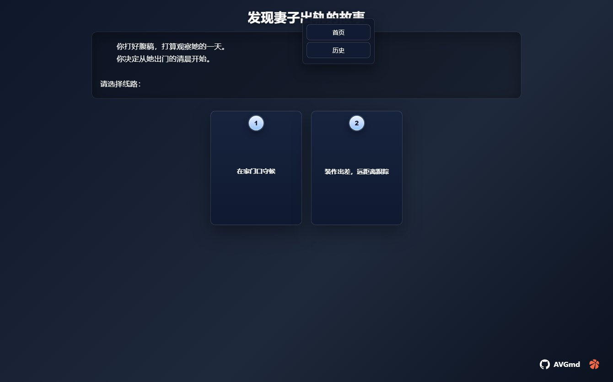
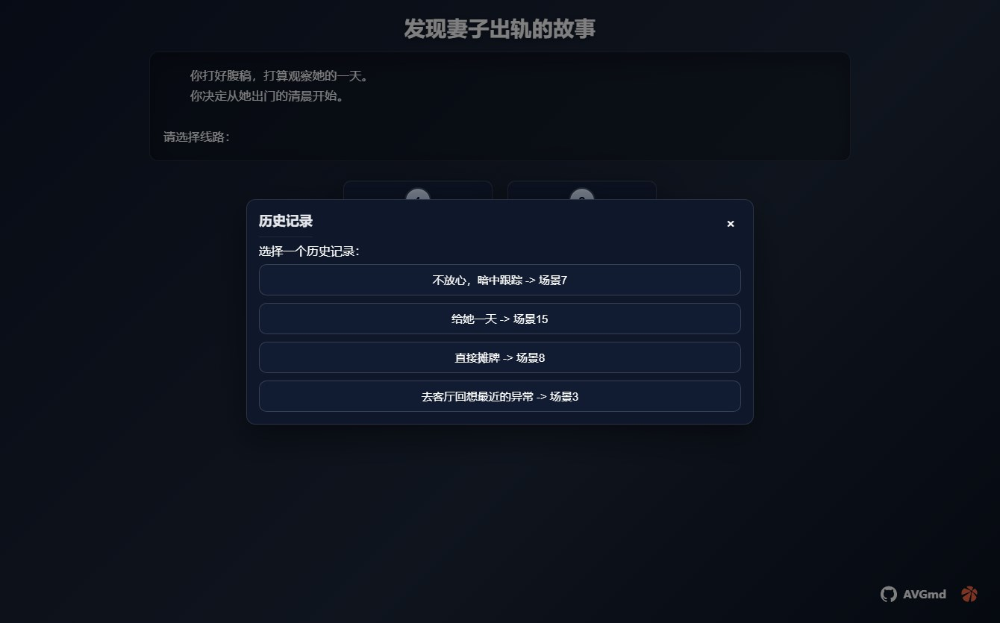

# AVGmd 文本冒险游戏

> 挺久的一个东西，想着现在有ai了，剧情就可以不用自己写了。

**如果接入酒馆，写一个人物故事模版，然后自动让你选择，可以无限玩下去。(可能剧情断档)**

## 使用方式

导入写好的md文件，然后运行，测试文件在[发现妻子出轨的故事](./MD/发现妻子出轨的故事.md)

```
https://iiistudio.github.io/AVGmd/MD/发现妻子出轨的故事.md
```
## 更新日志
### 2025年10月5日
- 添加快捷键
1. 键盘1-9对应选择，s是下一页。
- 添加历史记录（右键标题选择历史记录，首页是清空。）


- 优化刷新不会丢失记录(如果多窗口点击其他窗口刷新也会出现问题，如果不刷新继续好像是没问题。)
- 优化图片样式使用FancyBox
- 添加可以使用产生加载例如：https://iiistudio.github.io/AVGmd/?md=https://iiistudio.github.io/AVGmd/MD/发现妻子出轨的故事.md
- 修改选择css

- 修改全局css


## MD内容介绍
### 换行说明
已场景1开头，每个场景都有编号。

\n是换行，如果是在md直接换行是下一个，例如：
```
场景1
今天天气很好\n是啊
```
那么出现的结果是
```
今天天气很好
是啊
```
如果是
```
场景1
今天天气很好
是啊
```
那么先显示 今天天气很好 然后出现下一页按键在显示 是啊

### 过度剧情方式
```
选择：背景介绍 -> 场景2
选择：故事开始 -> 场景3
```
这样就出现2个按键对应不同的场景。

### 图片说明
```

```
## AI生成MD

例如：让deepseek写，发给他模版（剧情需要自己修改下）


## 图片


