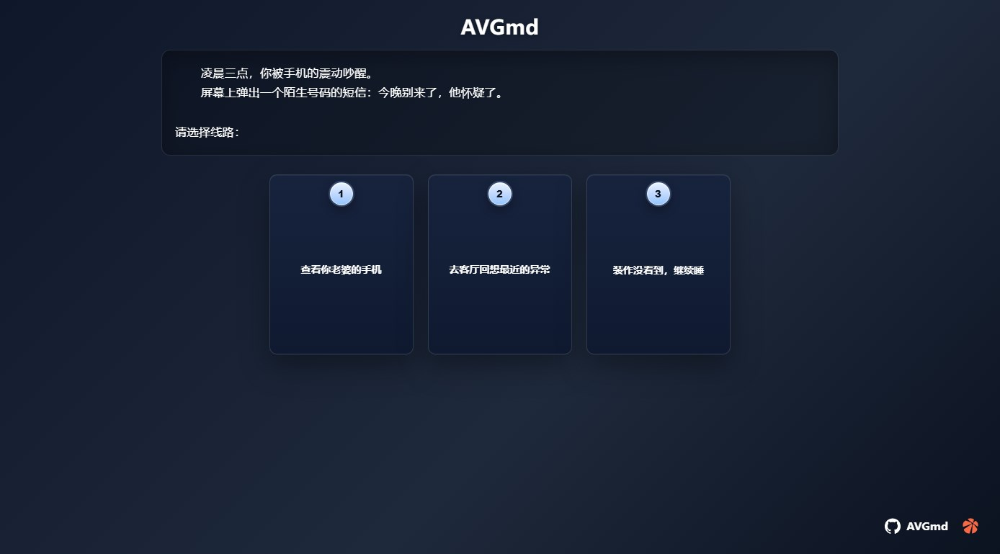
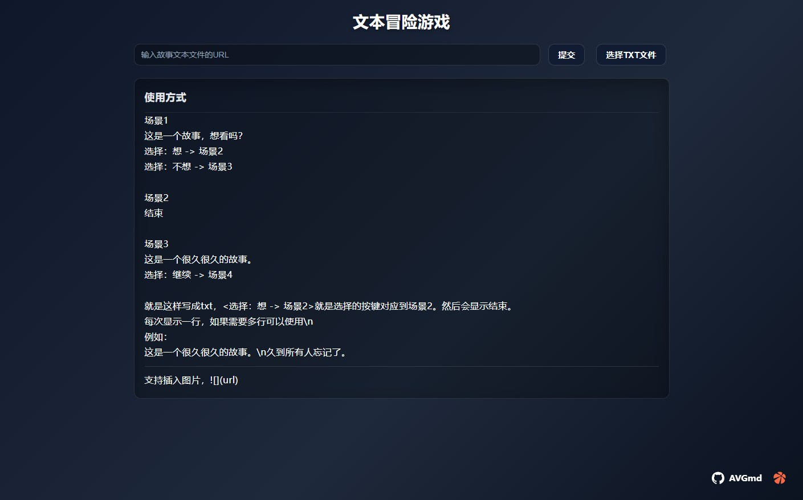
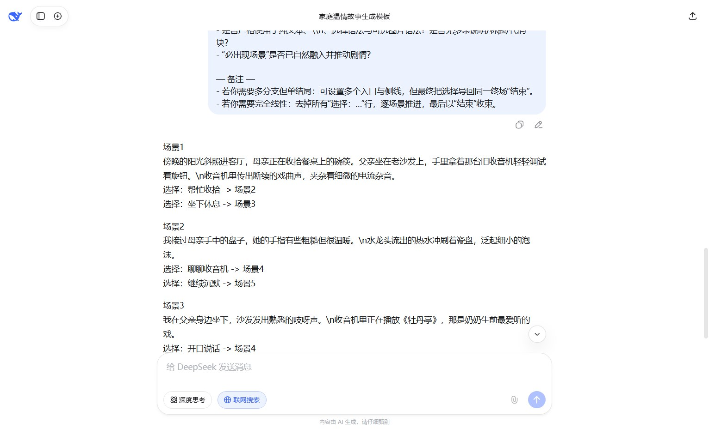
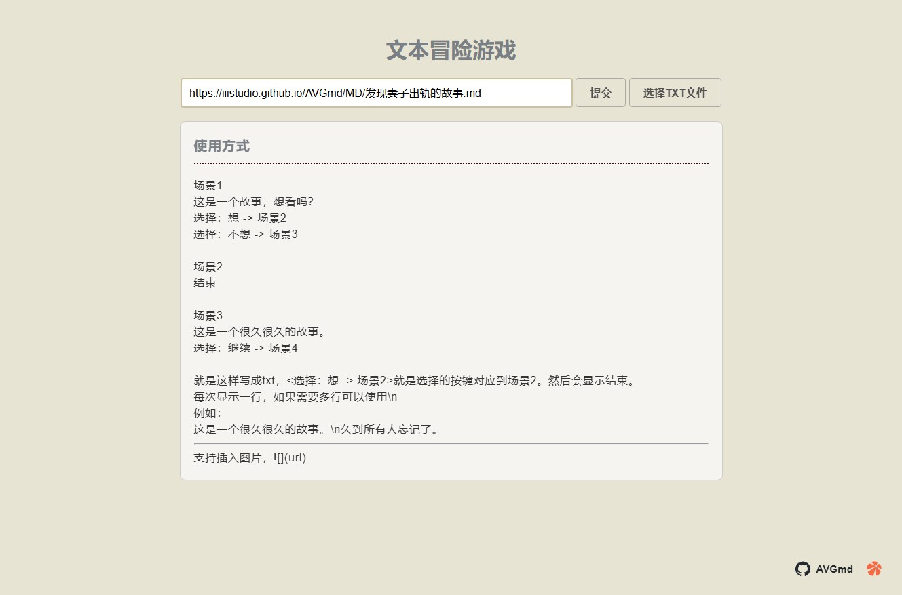
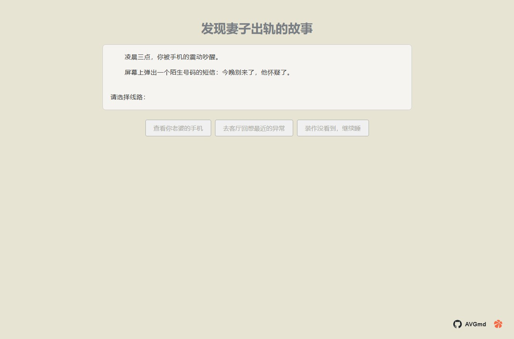

# AVGmd 文本冒险游戏

> 挺久的一个东西，想着现在有ai了，剧情就可以不用自己写了。

**如果接入酒馆，写一个人物故事模版，然后自动让你选择，可以无限玩下去。(可能剧情断档)**

## 使用方式

导入写好的md文件，然后运行，测试文件在[发现妻子出轨的故事](./MD/发现妻子出轨的故事.md)

```
https://iiistudio.github.io/AVGmd/MD/发现妻子出轨的故事.md
```

## 更新日志
### 2025年10月5日
- 添加可以使用产生加载例如：https://iiistudio.github.io/AVGmd/?md=https://iiistudio.github.io/AVGmd/MD/发现妻子出轨的故事.md
- 修改选择css

- 修改全局css


例如：让deepseek写，发给他模版（剧情需要自己修改下）



## 图片



